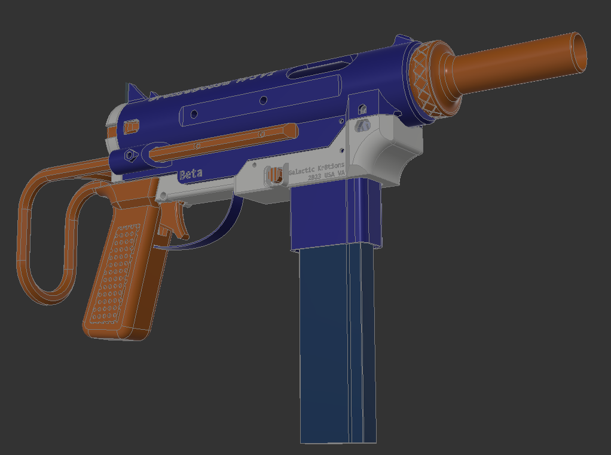
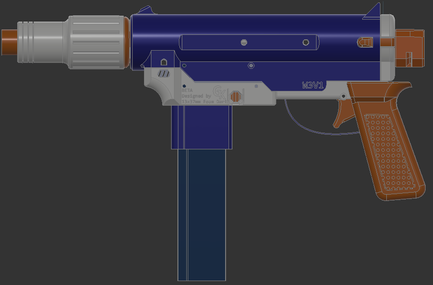

# GreaseGoose BETA
A FlyCore-Based Full Auto Electric Foam Blaster

## Overview

As of 2/3/2023 these files are provided as-is with no warranty. Contact me before selling or distrubuting modified parts before release.

Work-in-progress manual can be found here: http://greasegoose.gkr8tions.com

Find me on Discord at GalaxyCr8r#6911 (You may need to join r/nerf, OFD, or FluxLab's discords to message me)

Uses the excellent FlyCore platform: https://github.com/oldfieldadamg/OFD_Flycore_Straight

### Options

Shown with the BCAR and N-Strike-compatible stock attachment point. Not shown: front and rear sling mounts.

## Bill of Materials

 - FTW- or Nightningale-compatible FlyCore
   - (2) 130 motors
   - (1) N20 Pusher Motor of your choice! (300- 3000rpm)
   - (4) m2x5mm motor screws
   - (8-9) M3 x 5mm diameter x 6mm deep heat set inserts (longer ones may not work)
   - (6) M2.6x12mm toy screws
   - (1) M2.6x10mm toy screw (Optional)
   - (1) Cherry DB2 style switch for pusher position (Optional)
   - (1) Spring 20mm in length less than 7mm in diameter for mag release (Recommend McMaster 9657K297 Trimmed to ~20-22mm)
 - (1) Dart Head
 - (1) 21A Microswitch (Genuine Omron) Lever-Style (https://outofdarts.com/products/21a-microswitch-genuine-omron-v-212-1c6-spdt)
 - (1) 10A Microswitch (Cherry DB2 pin plunger) Plunger-Style (https://outofdarts.com/products/10a-microswitch-cherry-db2-plunger)
 - (2) M2.6x12mm toy screws (One can be longer than the other)
 - (1) M3x25mm
 - (2) M3x16mm
 - (6) M3x10mm
 - (2-4) M3x8mm
 - (2-3) M3x6mm
 - (3-5) M3 Threaded Heat-Set Inserts
 - Optional Parts:
   - BCAR Muzzle:
      - (9) 3x7x3 F683ZZ flanged bearings
      - (9) 3x14mm pins
      - Available Amazon, Alibaba, and Moose Mod Shop: https://moose-mod-shop.myshopify.com/products/3-3x7x3-bcar-bearings-and-pins
   - Fidlock:
      - M4 heat-set threaded inserts
      - Fidlock magnets (https://outofdarts.com/products/fidlock-snap-male-bolt-magnet-medium)
   - Split Receiver: M3x6mm screw
   - NStrike Stock:
      - (3) M3 Threaded Heat-Set Insert OR 3x M3 Hex Nuts
      - (3) M3x18mm
